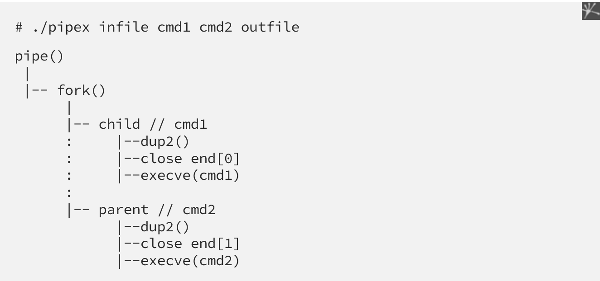

# pipex
## Annuaire

1. Fork()
2. Execve()
3. Wait()
4. Pipe()
5. Dup2()
---
`fork()` : Divise un processur en deux sous-processus qui se produisent en même temps. 
Ca return 0 pour le processus enfant, et un nombre non null pour le processus parent, ou -1 si erreur.

Exemple : 
```c
{
    // processes enfant parce que la valeur de retour est zéro.
    if (fork() == 0)
        printf("Hello from Child!\n");
 
    // processus parent parce que la valeur de retour est non nulle.
    else
        printf("Hello from Parent!\n");
}

int main()
{
    forkexemple();
}
````
---
`execve()` : Execute un programme en remplaçant le processus courant.

Exemple : 

```c
{
    // On utilise la fonction execve() pour exécuter la commande ls
    // dans le processus enfant.
    if (fork() == 0)
        execve("/bin/ls", NULL, NULL);
 
    // On utilise la fonction execve() pour exécuter la commande ps
    // dans le processus parent.
    else
        execve("/bin/ps", NULL, NULL);
}
````
---
`pipe()` : Crée un pipe/tube nommé, un canal de communication 
bidirectionnel qui peut être utilisé pour la communication entre processus.

Exemple : 

```c
#include <stdio.h>
#include <unistd.h>

int main()
{
    int fd[2];  // Tableau pour stocker les descripteurs de fichiers du tuyau
    pid_t pid; // Variable pour stocker le PID du processus
    
    if (pipe(fd) == -1) {  // Création du tuyau
        perror("pipe");  // En cas d'erreur
        return 1;
    }
    
    pid = fork();  // Création d'un nouveau processus
    
    if (pid == -1) {  // En cas d'erreur
        perror("fork");
        return 1;
    }
    else if (pid == 0) {  // Code du processus P1 (fils)
        close(fd[0]);  // Fermeture du descripteur de lecture inutilisé 
        
        char message[] = "Bonjour, papa!";  
        write(fd[1], message, sizeof(message)); // Ecriture du message dans le tuyau
        
        close(fd[1]);  // Fermeture du descripteur d'écriture
        
        return 0;
    }
    else {  // Code du processus P2 (père)
        close(fd[1]);  // Fermeture du descripteur d'écriture inutilisé
        
        char buffer[100];
        read(fd[0], buffer, sizeof(buffer));  // Lecture du message depuis le tuyau
        printf("Message reçu : %s\n", buffer); 
        
        close(fd[0]);  // Fermeture du descripteur de lecture
        
        return 0;
    }
}
````
---
`wait()` : Attend la fin dun processus enfant.
 `dup2()` : Echange nos fichiers avec stdin et stdout

<>


 